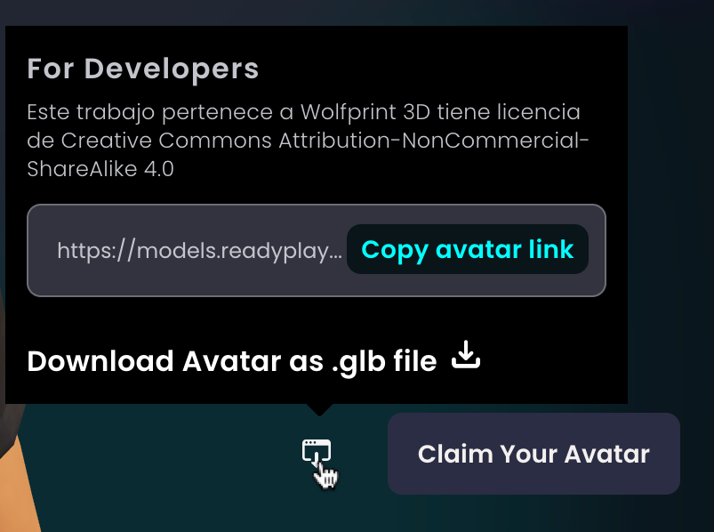
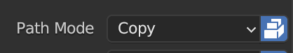

  
  <h1 align="center">Reto AR con Aframe</h1>
  

## Tabla de contenido

- [Tabla de contenido](#tabla-de-contenido)
- [Descripción](#descripción)
- [Herramientas utilizadas](#herramientas-utilizadas)
- [Pasos a seguir](#pasos-a-seguir)

## Descripción

Este repositorio contiene un proyecto de realidad aumentada con A-Frame. El proyecto consiste en crear una web donde salude mi avatar en Realidad Aumentada. Como pista para el reto, se puede utilizar el siguiente [proyecto](https://aframe.io/blog/webxr-ar-module/).

## Herramientas utilizadas

- 
- 
- 
- 

## Pasos a seguir

1. Crear un avatar en [Ready Player Me](https://readyplayer.me/).
   
2. Exportarlo con textura
   1. Abrir blender y borrar todo lo que tenga la escena.
   2. En Blender, importar el avatar y exportarlo en formato Collada (.dae).
   3. En Blender, borrar todo lo que tenga la escena y volver a importar el avatar, esta vez el archivo Collada.
   4. Exportar el avatar en formato fbx, poniendo Path Mode en Copy y seleccionando la opción de Embebed Textures.
      
3. Animar el avatar con [Mixamo](https://www.mixamo.com/).
   1. Importar el avatar en Mixamo.
   2. Seleccionar la animación deseada.
   3. Descargar el avatar con la animación.
4. Crear una escena en A-Frame. He usado la siguiente [base](https://aframe.io/docs/1.6.0/introduction/#getting-started) para entender los componentes básicos.
   1. Añadir scrips necesarios
   2. Añadir entidades al gusto
   3. Colocar las entidades en las posiciones deseadas
   4. Por último, añadir la funcionalidad de AR como en el proyecto de pista.
